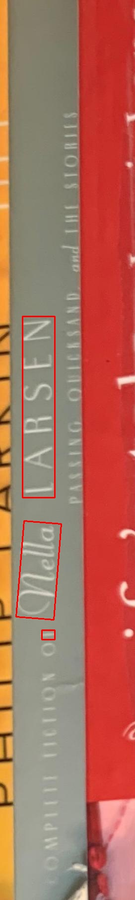

# UMU-Machine-Vision-Project
The git repository for the course "Course Project in Machine Vision" at Umeå University.

This project aims to process bookshelf photos in such a way that relevant information per book (i.e. title, author, publisher) is recognized and displayed.

## Structure
This repository is a work in progress, this is the current structure:
- **Image Segmentation**
  - Segmentation of shelf pictures into single book spines
    - First, shelves are segmented
    - Next, book spines are segmented
- **Text Localization**
  - Localization of text on book spines
    - This is done using a CRAFT implementation (using pretrained weights)
  - Uses multiple rotations (0°, 90°, 180° and 270°) to find textboxes
  - Discards vertical textboxes as post-processing step
- **Text Recognition**
  - Recognition of localized text
    - This is done using a 4 stage network (using pretrained weights)
- **Book API**
  - Processing of recognized text and sending of requests to a book API
    - Currently done using Google Books API
    - This step tries to match the recognized text to a book

## Results

Some example result images can be found in the [results](results) folder.

### Accuracy
For the testing images in [segmentation/images](segmentation/images) the performance is as follows:

| Input image | Output image | Recognizable books in image | Books segmented | Titles correctly retrieved (% of total/% of segmented) | Notes |
| --- | --- | --- | --- | --- | --- |
| [img0.jpg](segmentation/images/im0.jpg) | [outputPlotWithInfo-0.jpg](results/outputPlotWithInfo-0.jpg) | 51 | 45 (88%) | 28 (54%/62%) |
| [img1.jpg](segmentation/images/im1.jpg) | [outputPlotWithInfo-1.jpg](results/outputPlotWithInfo-1.jpg) | 82 | 68 (83%) | 46 (56%/68%) |
| [img2.jpg](segmentation/images/im2.jpg) | [outputPlotWithInfo-2.jpg](results/outputPlotWithInfo-2.jpg) | 72 | 71 (98%) | 48 (66%/68%) |
| [img3.jpg](segmentation/images/im3.jpg) | [outputPlotWithInfo-3.jpg](results/outputPlotWithInfo-3.jpg) | 37 | 36 (97%) | 23 (62%/64%) |
| [img4.jpg](segmentation/images/im4.jpg) | [outputPlotWithInfo-4.jpg](results/outputPlotWithInfo-4.jpg) | 10 | 8 (80%) | 3 (30%/38%) |
| [img5.jpg](segmentation/images/im5.jpg) | [outputPlotWithInfo-5.jpg](results/outputPlotWithInfo-5.jpg) | 12 | 11 (91%) | 6 (50%/55%) |
| [img6.jpg](segmentation/images/im6.jpg) | [outputPlotWithInfo-6.jpg](results/outputPlotWithInfo-6.jpg) | 65 | 51 (78%) | 34 (52%/67%) |
| [img7.jpg](segmentation/images/im7.jpg) | [outputPlotWithInfo-7.jpg](results/outputPlotWithInfo-7.jpg) | 25 | 22 (88%) | N/A | Not supported: Non-English Text |
| [img8.jpg](segmentation/images/im8.jpg) | [outputPlotWithInfo-8.jpg](results/outputPlotWithInfo-8.jpg) | 7 | 4 (57%) | N/A | Not supported: Non-English text (low-res image) | 
| [img9.jpg](segmentation/images/im9.jpg) | [outputPlotWithInfo-9.jpg](results/outputPlotWithInfo-9.jpg) | 37 | 22 (59%) | 13 (35%) | Not supported: horizontal books, non-english text (only vertical books counted) | 
| [img11.jpg](segmentation/images/im11.jpg) | [outputPlotWithInfo-11.jpg](results/outputPlotWithInfo-11.jpg) | 17 | 14 (82%) | 10 (59%/72%) | Not supported: Some Non-English books |
| [img12.jpg](segmentation/images/im12.jpg) | [outputPlotWithInfo-12.jpg](results/outputPlotWithInfo-12.jpg) | 22 | 16 (73%) | 10 (45%/63%) | Not supported: Some Non-English books |
| [img13.jpg](segmentation/images/im13.jpg) | [outputPlotWithInfo-13.jpg](results/outputPlotWithInfo-13.jpg) | 22 | 19 (86%) | 10 (45%/53%)| Not supported: Some Non-English books |

Not taking into account the images containing features that are not supported, that leaves 7 testing images containing library bookshelves, with an average accuracy of:

- Book segmentation: 89% of all books are correctly segmented
- Text localization & OCR: 60% of segmented book info is retrieved correctly
- Overall: 53% of all book info is retrieved correctly


## How to use

After making sure the requirements are met, run `./BookAIShell.py`.
To change the input image, change the arguments in `./BookAIShell.py` and provide the path to and name of the test image (see script for an example).
All intermediate results can be found under `./pipeline_test_output/shelltesting<time>/`
Users with deep nested directories might want make sure that their operating system supports long path names. On Windows for example this has to be enabled through the registry. If the sum of path and file name is too long it can lead to an error where some intermediate results are not stored causing further errors.

This project also come with a GUI, run `./QtWrapper.py` to open the GUI.
To run the recognition, an input image and an output image have to be selected first by using the "Browse" buttons.
The recognition itself can be started with the "Recognize books..." button.
When the recognition finishes, a small notification pops up. The resulting output plots can be found in the specified output folder.

## Requirements

The localization requires the following python packages (see also `requirements.txt`):
- numpy
- matplotlib
- pytorch (including torchvision)
- opencv-python
- scikit-learn
- scikit-image
- six  
- scipy
- Pillow
- requests 
- natsort
- lmdb
- pandas
- numba
- pyenchant
- Levenshtein

Please note that automatic installation of pytorch using `requirements.txt` seems to fail, install it using pip3 install <...> instead (see the pytorch website for more details).

## Image Segmentation


This module takes an image of a bookshelf and extracts each book contained within the image as a seperate image. It also provides information about the location of the books and planks in the bookshelf.

It consists of two sequential steps: plank segmentation and book segmentation. Both can also be used individually. These steps are explained in more detail below.

**Note**: throughout the documentation and code the word _shelf_ and _plank_ are used interchangeably to indicate a plank in a bookshelf.

### Input Restrictions

This module was designed with a few constraints around the input image to simplify processing. They are:

#### Plank restrictions
 - Planks are straight, horizontal (&pm; 20 degrees), and in-line with each other.
 - No mixed plank heights; each plank should span (almost) the entire width of the image.
 - Images with more than 5 planks are not supported (the OCR probably doesn't work on them anyway).
 - Books are oriented vertically (&pm; 30 degrees). Stacked books will cause plank segmentation to fail.

#### Book restrictions
 - Books are oriented vertically (&pm; 30 degrees).
 - Books are higher than they are wide (at least 3 times as high).
 - The width of a book is at least 1% and at most 70% of an image.
 - Book titles and texts are in English

### Running the module

The main class of this module can be found in [`BookSegmenter.py`](segmentation/BookSegmenter.py). [`segment.py`](segment.py) contains some example code to show how this module can be used and what the result string contains.

### Plank segmentation
The plank segmentation algorithm used consists of the following steps:
 1. The image is resized to 25% of the original size.
 2. A Gaussian blur is applied and the image is binarized using the Canny edge detector.
 3. 90% of the least eccentric features are discarded.
 4. All features smaller than 50 pixels are discarded
 5. The remaining features are dilated to increase their size in the y-direction
 6. The Hough Line Transform is used to detect horizontal lines
 7. K-means clustering is applied to the lines in parameter space (`a` and `b` in `y=a*x+b`).
 8. The lines are grouped to create shelf regions (characterized by four corner coordinates).
 9. Plank regions smaller than 85% of the average height are discarded to prevent including planks that are cropped by the top or bottom of the image.
 10. The plank regions are used to segment the original image into images containing only one row of books.

### Book segmentation
The algorithm and code for book segmentation is based on a [paper](https://github.com/imruljubair/A-Technique-to-Detect-Books-from-Library-Bookshelf-Image) on the topic. The code from the paper was converted from matlab to python and heavily optimized using the Numbas python library.

To improve the results, K-means clustering was introduced to cluster the lines between the books, and additional book detection heuristics (see [`validateBook.py`](./segmentation/matlab/validateBook.py)) were added.


## Localization
### Introduction

The localization module is based on an [implementation of CRAFT](https://github.com/clovaai/deep-text-recognition-benchmark).
Some scripts have been modified and some code has been added to suit the needs of this project.

### Localization using CRAFT
#### How to use

The CRAFT module is currently not supposed to be used outside of the shell program.
However, it is possible to run it by creating a new script `./call_craft.py` with the following contents:
```python
import CRAFT.pipeline as pipeline

if __name__ == '__main__':
    pipeline.main('PATH/TO/SHELLTESTING<TIME>/localizationocr')
```
Run the new script to run the CRAFT module separately from the other modules.
Note that the `localizationocr` folder needs to contain the output of the segmentation module.

The CRAFT module outputs images with segmented textboxes from input images created by the segmentation module.
Heat maps are saved to `.../localizationocr/results/masks/`, the input images with localised bounding boxes are saved to `.../localizationocr/results/localised` and a file `data.csv` is saved to `.../localizationocr/results/` that includes some metadata, such as bounding box corner coordinates per input image.
The cropped text images are saved to `.../localizationocr/cropped/`.

#### Background
The localization module uses CRAFT to detect scene text. Before running the model to get such bounding boxes, each input image is rotated 4 times to ensure all text orientations are taken into consideration (and because CRAFT appears to yield varying results with different input orientations).
The image is rotated by 90°, 180° and 270° clockwise before localization.
The following images are examples of how localization depends on the input orientation.





After localization, bounding boxes are evaluated and their height and width compared.
Bounding boxes with a bigger height than width are discarded  (see `./CRAFT/crop_images.py`), as these are usually bounding boxes for vertical text.
Below are examples of cropped text images, with the second image being an example of a small word that could not have been extracted from a horizontal input as it is perpendicular to the book title.


#### Notes

- Yes, I know I use both "localisation" and "localization". It wasn't intended and isn't important enough a mistake to change in the code.
- Also, yes, they spell it "Appendixes"...

## Text Recognition

The OCR (optical character recognition) module takes cropped images as input and predicts their words and confidence scores.
It's based on [this implementation of OCR](https://github.com/clovaai/deep-text-recognition-benchmark) (currently using a four-stage None-VGG-BiLSTM-CTC model).

The entry point for the OCR module is `./OCR/recognition.py`.
A function `save_recognition` is responsible for reading the output of the OCR and adding information such as...
- shelf
  - saves a string (i.e. `shelf-0`) to determine the shelf associated with the cropped text
- book
  - saves a string (i.e. `book-0`) to determine the book associated with the cropped text
- rotation
  - saves a number (0, 90, 180 or 270) to determine what rotation the cropped text was taken from
- ltx, lty, rtx, rty, rbx, rby, lbx and lby
  - 4 corner point coordinates determining the text box corner coordinates in the rotated, segmented book spine image
- m1 and m2
  - a midpoint coordinate that determines the center position of the text box in the rotated, segmented book spine image
- width and height
  - the width and height of the rotated text box
- original_width and original_height
  - the original width and height of the rotated, segmented book spine image
  
A script `group_boxes.py` is responsible for some more post-processing and is called by the shell program after the recognition script.
`group_boxes.py` is responsible for determining overlapping textboxes per book.
This means that every textbox within a book is matched against all other found textboxes (all rotations) within the same book.
If the center coordinates of two textboxes are close enough together, information about their association is stored in the resulting `.csv`.
To be precise, `group_boxes.py` adds...
- midx_original and midy_original
  - the same center coordinates of the textbox, but rotated to be in the 0° coordinate system
- text_box_id
  - and ID per text box within a book (unique across all textboxes within a book)
- includes
  - a list of text box IDs that are close to this text box

The resulting .csv for all the information just mentioned per cropped image is placed in `.../localizationocr/results/`
 

## Book API

The book API part expects a .csv file from the OCR part and a path where to store the results. From the data in the .csv file a string is created that is passed to the the Google Books API. From the API additional information about the book is retrieved and it also allows to differentiate between title and author.

All code for this part is in the file `searchstring_and_API.py`. Either the function `retrieve_results_from_API` or `retrieve_books` needs to be called from the shell program. The main difference between them is how the search string is created. `retrieve_books` is the preferred choice.
If the API part should be run solitary for whatever reason, you can use the script `run_api_stuff_only.py` and specify the path to the .csv file

The results are stored in the file `Recognized_books.txt` in the directory `./pipeline_test_output/shelltesting<time>/` and look like this:

Book \#1:\
Result for search string: silver music mina baites\
The Silver Music Box\
written by ['Mina Baites']\
published by Silver Music Box series\
published on 2017-12\
ISBN_10: 1542048486\
ISBN_13: 9781542048484\
number of pages: 272\
\---\
Book \#2:\
Result for search string: sceptre gives Kirsten Monsieur banksia \
No results found for +sceptre+gives+Kirsten+Monsieur+banksia+\
\---\
Book \#3:\
...

